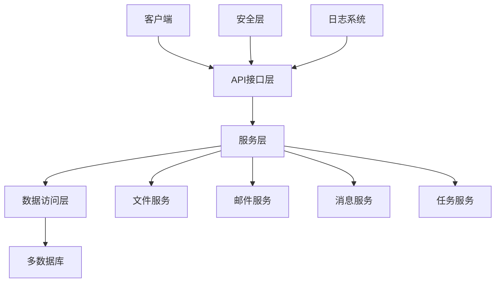

# DynamicDbApi 项目说明文档

## 1. 项目概述

DynamicDbApi 是一个灵活、强大的数据库访问中间件，允许通过统一的REST API接口访问和操作多种类型的数据库，无需编写特定的数据库访问代码。系统支持动态切换数据库连接，并提供完善的权限控制和安全机制。

除了核心的数据库操作功能外，系统还集成了文件管理、邮件发送、实时消息和定时任务等多种实用功能，为应用开发提供全方位支持。

## 2. 系统架构

### 2.1 技术栈

- **后端框架**：ASP.NET Core 8.0
- **ORM框架**：SqlSugar ORM（支持多数据库）
- **数据库**：默认使用SQLite，支持SQL Server、MySQL、Oracle、PostgreSQL
- **API文档**：Swagger/OpenAPI
- **身份验证**：JWT（JSON Web Token）
- **日志框架**：Serilog
- **实时通信**：SignalR
- **任务调度**：Quartz.NET

### 2.2 系统架构图



### 2.3 目录结构

- **Controllers/**: API控制器
- **Models/**: 数据模型
- **Services/**: 业务服务
- **Data/**: 数据访问和数据库初始化
- **Infrastructure/**: 基础设施代码
- **Common/**: 通用工具类
- **Hubs/**: SignalR实时通信集线器
- **wwwroot/**: 静态资源

## 3. 核心功能

### 3.1 多数据库支持
**功能说明**：系统采用SqlSugar ORM框架实现了强大的多数据库支持，允许用户在运行时动态管理和切换不同类型的数据库连接。

**支持的数据库类型**：
- SQLite
- MySQL
- SQL Server
- PostgreSQL
- Oracle

**核心特性**：
- 支持多个数据库并行使用，可通过连接ID在API请求中指定目标数据库
- 自动连接池管理，优化数据库连接性能
- 提供数据库连接测试功能
- 支持动态添加、更新和删除数据库连接配置
- 可设置默认数据库，简化日常操作

**实现方式**：通过DatabaseConnectionManager服务实现连接管理，使用SqlSugarClient进行数据库操作，支持连接字符串配置和运行时动态切换。

### 3.2 动态JSON查询
**功能说明**：通过统一的JSON格式API实现对任意数据库表的完整CRUD操作，支持复杂条件查询、排序、分页、关联查询等，无需编写SQL语句。

**核心特性**：
- 基于SQLSugar ORM框架，支持多种数据库方言
- 支持完整的CRUD操作（查询、插入、更新、删除）
- 支持丰富的查询条件操作符（等于、不等于、大于、小于、模糊查询等）
- 支持字段选择、排序、分页功能
- 支持表关联查询（INNER JOIN、LEFT JOIN等）
- 支持分组查询和聚合函数
- 支持UNION联合查询
- 支持CTE（通用表表达式）查询，包括递归CTE
- 集成权限控制，确保数据访问安全
- 动态表结构获取和创建

#### 3.2.1 动态JSON查询接口


### 3.3 实时消息系统
**功能说明**：基于SignalR实现的实时消息通信系统，支持一对一消息、群组消息和广播消息，提供消息持久化存储、已读状态管理和操作消息功能。

**核心特性**：
- 支持三种消息模式：一对一用户消息、群组消息和全局广播
- 提供普通消息和带操作的特殊消息（可触发客户端行为）
- 消息持久化存储，支持历史消息查询
- 消息已读状态管理（单条标记已读、全部标记已读）
- 用户在线状态跟踪和连接管理
- 群组管理功能（创建群组、加入/离开群组）
- 完整的权限控制集成

#### 3.3.1 实时消息API接口

##### 发送普通消息
**接口地址**：`POST /api/RealTimeMessage/send`
**权限要求**：需要认证

**请求示例**：
```json
{
  "content": "Hello, World!",
  "receiverType": "User",
  "receiverId": "user123"
}
```

##### 发送带操作的消息
**接口地址**：`POST /api/RealTimeMessage/send-action`
**权限要求**：需要认证

**请求示例**：
```json
{
  "content": "请确认操作",
  "actionType": "confirm",
  "actionPayload": "{\"actionId\": \"123\", \"timeout\": 30}",
  "receiverType": "User",
  "receiverId": "user123"
}
```

##### 获取未读消息
**接口地址**：`GET /api/RealTimeMessage/unread`
**权限要求**：需要认证

##### 标记消息为已读
**接口地址**：`POST /api/RealTimeMessage/mark-read/{messageId}`
**权限要求**：需要认证

##### 标记所有消息为已读
**接口地址**：`POST /api/RealTimeMessage/mark-all-read`
**权限要求**：需要认证

#### 3.3.2 客户端连接示例

##### 连接SignalR Hub
```javascript
// 客户端连接代码示例（JavaScript/TypeScript）
import * as signalR from "@microsoft/signalr";

const connection = new signalR.HubConnectionBuilder()
    .withUrl("/MessageHub?userId=currentUser")
    .withAutomaticReconnect()
    .build();

// 连接成功处理
connection.start().then(() => {
    console.log("Connected to message hub");
}).catch(err => console.error("Connection error:", err));

// 接收消息事件
connection.on("ReceiveMessage", (message) => {
    console.log("New message received:", message);
    // 处理收到的消息
});

// 接收群聊消息事件
connection.on("ReceiveGroupMessage", (message) => {
    console.log("New group message received:", message);
    // 处理收到的群聊消息
});

// 加入群组
async function joinGroup(groupId) {
    try {
        await connection.invoke("JoinGroup", groupId);
        console.log(`Joined group: ${groupId}`);
    } catch (err) {
        console.error("Error joining group:", err);
    }
}

// 离开群组
async function leaveGroup(groupId) {
    try {
        await connection.invoke("LeaveGroup", groupId);
        console.log(`Left group: ${groupId}`);
    } catch (err) {
        console.error("Error leaving group:", err);
    }
}

// 直接发送群聊消息
async function sendGroupMessage(groupId, content) {
    try {
        await connection.invoke("SendToGroup", groupId, content);
        console.log("Group message sent");
    } catch (err) {
        console.error("Error sending group message:", err);
    }
}
```

### 3.4 缓存层
**功能说明**：系统集成了高效的缓存机制，用于存储频繁查询的结果，减少数据库访问压力，提高API响应速度。

**核心特性**：
- 基于内存的缓存实现，支持快速存取数据
- 自动缓存失效机制，当相关数据发生变更时自动清除缓存
- 可配置的缓存过期时间，默认缓存时间为10分钟
- 支持按表清除缓存，确保数据一致性
- 集成到动态查询服务中，无需额外配置即可使用

**实现方式**：
- 通过ICacheService接口定义缓存操作规范
- 提供MemoryCacheService实现内存缓存功能
- 在DynamicQueryService中自动缓存查询结果
- 在插入、更新、删除操作时自动清除相关表的缓存

**缓存键生成**：
- 基于查询语句、参数、数据库ID和表名生成唯一缓存键
- 使用MD5哈希算法确保缓存键的唯一性和固定长度

**使用示例**：
```csharp
// 查询自动使用缓存
var queryResult = await _dynamicQueryService.ExecuteSelectAsync(queryRequest);

// 缓存会在数据变更时自动失效
await _dynamicQueryService.ExecuteUpdateAsync(updateRequest);
```

### 3.5 API限流功能
**功能说明**：系统实现了API限流机制，防止恶意请求和过度使用，保护系统稳定运行。

**核心特性**：
- 基于固定窗口算法的限流策略
- 支持多级别限流配置（默认策略和查询专用策略）
- 可配置的请求上限和排队机制
- 返回标准的429 Too Many Requests响应
- 对查询操作实施更严格的限流，保护数据库资源

**限流策略配置**：
- **默认策略**：每分钟允许100个请求，超过部分排队，最多排队50个请求
- **查询策略**：每分钟允许50个请求，超过部分排队，最多排队20个请求

**使用方式**：
- 全局配置在Program.cs中定义
- 通过EnableRateLimiting属性为API端点指定限流策略
- 客户端收到429响应时应实现退避机制

**配置示例**：
```csharp
// 在Program.cs中配置限流策略
builder.Services.AddRateLimiter(options =>
{
    options.RejectionStatusCode = StatusCodes.Status429TooManyRequests;
    
    // 默认限流策略
    options.AddFixedWindowLimiter("default", fixedWindowOptions =>
    {
        fixedWindowOptions.Window = TimeSpan.FromMinutes(1);
        fixedWindowOptions.PermitLimit = 100;
        fixedWindowOptions.QueueLimit = 50;
    });
    
    // 查询操作限流策略
    options.AddFixedWindowLimiter("query", fixedWindowOptions =>
    {
        fixedWindowOptions.Window = TimeSpan.FromMinutes(1);
        fixedWindowOptions.PermitLimit = 50;
        fixedWindowOptions.QueueLimit = 20;
    });
});

// 在控制器中应用限流策略
[HttpPost("execute")]
[EnableRateLimiting("query")]
public async Task<ActionResult<DynamicQueryResponse>> ExecuteQuery([FromBody] DynamicQueryRequest request)
```

### 3.6 邮件服务
**功能说明**：基于MailKit实现的企业级邮件服务，支持多SMTP服务器配置、HTML邮件发送、连接测试等功能，适用于系统通知、用户验证、报表发送等场景。

#### 3.6.1 核心特性
- 支持多SMTP服务器配置和默认服务器设置
- 支持纯文本和HTML格式邮件发送
- 提供SMTP连接测试功能
- 完善的错误处理和日志记录
- 集成权限控制，确保邮件服务安全访问
- 支持自定义发件人和显示名称

#### 3.6.2 邮件服务API

**1. 发送邮件**
**接口地址**：`POST /api/Mail/send`

**请求示例**：
```json
{
  "ServerId": "default",
  "From": "system@example.com",
  "To": "user@example.com",
  "Subject": "系统通知",
  "Body": "<h1>这是一封测试邮件</h1><p>您的账户已成功激活</p>",
  "IsHtml": true
}
```

**2. 获取邮件服务器列表**
**接口地址**：`GET /api/Mail/servers`

**3. 测试SMTP连接**
**接口地址**：`POST /api/Mail/test-connection`

**4. 创建邮件服务器配置**
**接口地址**：`POST /api/Mail/servers`

### 3.7 定时任务系统
**功能说明**：基于Quartz.NET实现的企业级定时任务管理系统，支持Cron表达式和简单时间间隔两种触发方式，提供完整的任务生命周期管理和监控功能。

#### 3.7.1 核心特性
- 支持两种触发器类型：Cron表达式和简单时间间隔
- 提供任务的创建、启动、暂停、恢复、删除等完整生命周期管理
- 支持手动触发任务执行
- 自动记录任务执行状态和时间信息
- 提供调度器状态管理（启动/停止）
- 完善的参数验证和错误处理

#### 3.7.2 定时任务API

**1. 启动调度器**
**接口地址**：`POST /api/Scheduler/start`

**2. 停止调度器**
**接口地址**：`POST /api/Scheduler/stop`

**3. 创建定时任务**
**接口地址**：`POST /api/Scheduler/tasks`

**使用Cron表达式的任务示例**：
```json
{
  "Name": "daily_report",
  "Description": "每日报表生成任务",
  "JobType": "ReportJob",
  "TriggerType": "Cron",
  "TriggerExpression": "0 0 1 * * ?", // 每天凌晨1点执行
  "StartTime": "2024-01-01T00:00:00Z",
  "IsActive": true
}
```

**使用时间间隔的任务示例**：
```json
{
  "Name": "hourly_check",
  "Description": "每小时检查任务",
  "JobType": "HealthCheckJob",
  "TriggerType": "Simple",
  "TriggerExpression": "01:00:00", // 每小时执行一次
  "IsActive": true
}
```

**4. 获取所有任务**
**接口地址**：`GET /api/Scheduler/tasks`

## 4. 技术实现细节

### 4.1 EF Core到SqlSugar迁移
**迁移背景**：系统从Entity Framework Core迁移到SqlSugar ORM框架，以提升性能、简化代码并增强多数据库支持能力。

#### 4.1.1 迁移优势
- **性能提升**：SqlSugar在动态查询和批量操作方面性能优于EF Core
- **语法简洁**：API设计更直观，减少了样板代码
- **多数据库支持**：原生支持更多数据库类型，包括Oracle、PostgreSQL等
- **动态SQL生成**：更强大的动态查询构建能力，适合动态JSON查询功能
- **学习成本低**：API设计符合直觉，开发人员容易掌握

#### 4.1.2 主要实现变更
- 重构了数据库连接管理系统，从EF Core的DbContext模式迁移到SqlSugarClient模式
- 替换了所有数据库操作代码，使用SqlSugar的API
- 实现了新的AppDbContext类，基于SqlSugar构建
- 优化了数据库迁移和初始化流程
- 增强了多数据库连接池管理

#### 4.1.3 代码示例对比

**原EF Core实现**（示意）：
```csharp
// 使用EF Core的DbContext
public class OldAppDbContext : DbContext
{
    public DbSet<User> Users { get; set; }
    
    protected override void OnModelCreating(ModelBuilder modelBuilder)
    {
        // 配置实体映射
    }
}

// 查询示例
var users = await _context.Users.Where(u => u.Age > 18).ToListAsync();
```

**新SqlSugar实现**：
```csharp
// 使用SqlSugar的客户端模式
public class AppDbContext
{
    public ISqlSugarClient Db { get; private set; }
    
    public ISugarQueryable<User> Users => Db.Queryable<User>();
}

// 查询示例
var users = await _context.Users.Where(u => u.Age > 18).ToListAsync();
```

## 5. 快速开始

### 5.1 环境要求
- .NET 7.0或8.0 SDK
- 支持的数据库（SQLite、MySQL、SQL Server等）

### 5.2 安装与运行

1. 克隆仓库：
```bash
git clone https://github.com/yourusername/DynamicDbApi.git
cd DynamicDbApi
```

2. 配置数据库连接：
编辑`appsettings.json`文件，配置数据库连接字符串。

3. 运行项目：
```bash
dotnet run
```

4. 访问API文档：
打开浏览器访问 `http://localhost:5000/swagger`

## 6. 配置说明

### 6.1 数据库配置
在`appsettings.json`中配置默认数据库连接：

```json
"ConnectionStrings": {
  "DefaultConnection": "Data Source=appdb.db"
}
```

### 6.2 JWT配置
```json
"JwtSettings": {
  "SecretKey": "your-secret-key",
  "Issuer": "DynamicDbApi",
  "Audience": "DynamicDbApiUsers",
  "ExpiresInMinutes": 30
}
```

### 6.3 日志配置
```json
"Logging": {
  "LogLevel": {
    "Default": "Information",
    "Microsoft.AspNetCore": "Warning"
  }
}
```

## 7. 部署指南

### 7.1 Docker部署

1. 构建Docker镜像：
```bash
docker build -t dynamicdbapi .
```

2. 运行Docker容器：
```bash
docker run -d -p 8080:80 --name dynamicdbapi dynamicdbapi
```

### 7.2 IIS部署

1. 发布项目：
```bash
dotnet publish -c Release -o ./publish
```

2. 在IIS中创建应用程序池和网站，指向发布目录。

## 8. 开发指南

### 8.1 项目结构

### 8.2 添加新功能

### 8.3 测试

## 9. 安全与权限

### 9.1 身份验证

### 9.2 授权

### 9.3 数据安全

## 10. 监控与日志

### 10.1 日志记录

### 10.2 性能监控

## 11. 常见问题

### 11.1 数据库连接问题

### 11.2 查询性能问题

### 11.3 权限问题

## 12. 更新日志

## 13. 贡献指南

## 14. 许可证
GNU Affero General Public License v3.0(AGPLv3)

## 15. 联系方式
